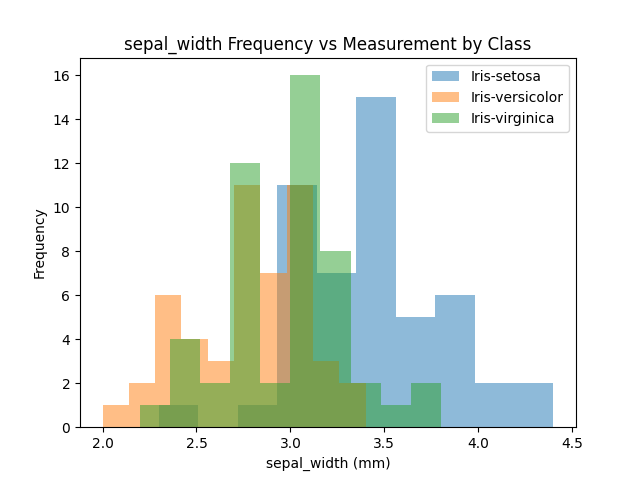

#Iris dataset analysis
###pands-project
####Author: Matthew Arthur

Research for the dataset online and summary.

The Iris Plants Database was authored by multidisciplinary scientist R.A. Fisher in 1936. [It contains information](https://onlinelibrary.wiley.com/doi/epdf/10.1111/j.1469-1809.1936.tb02137.x) regarding sepal and petal dimensions, as well as the variety of iris. The multivariate dataset contains a collection of measuremtns of sepal and petal lengths and widths of *Iris setosa*, *Iris versicolor*, and *Iris viriginica*. Despite it being published in the Annals of Eugenics it has long been used as a means to [demonstrate different capabilites of of data analysis and visualisation.](https://archive.ics.uci.edu/ml/datasets/iris) 

Need more on research

####Outputing a summary of each variable to a single text file:
The first requirement of the project is to create a text file containing a summary of each variable. To do this the pandas module was used, and the [`describe()` method](https://www.w3schools.com/python/pandas/ref_df_describe.asp) was used. This gives the number of occurences of each of the variables (petal and sepal length and width), their mean, standard deviation, minimium and maximum values of each of each, as well as their first, second, and third quartiles. 
While getting a summary of the data as a whole was straightforward using this method, breaking down down by class was a better option to better compare differences between the three classes of iris. The brief in the project detail file did not specify which way to do it, so I decided that summarizing by class would be the most meaningful. The [iris.names](iris.names) file found on the ICU page incudes summary statistics of the entire dataset, so not splitting out by class would be redundant. Doing it by class proved more difficult to format, with the code used to do so explained below. I have included a overall summary as well in the [01.0_analysis.py file](01.0_analysis.py), it has been commented out at the end. 

**Unreferenced program used to summarise the data by class:**
```python
import pandas as pd

# Load the iris dataset
iris_df = pd.read_csv('iris.data', header=None, names=['sepal_length', 'sepal_width', 'petal_length', 'petal_width', 'class'])

# Group the data by class and calculate summary statistics for each group
grouped_stats = iris_df.groupby('class').describe()


# Write the summary statistics to a text file
with open('01.1_iris_summary.txt', 'w') as f:
    for c in grouped_stats.columns.levels[0]:
        f.write('Variable: ' + c + '\n')
        f.write(str(grouped_stats[c]) + '\n\n')

f.close()
```

**Program explained line by line:**

`import pandas as pd`
This line is straightforward, it imports the module required to create the dataframe and names it 'pd' to make it easier to reference later. 
<br>

```python
iris_df = pd.read_csv('iris.data', header=None, names=['sepal_length', 'sepal_width', 'petal_length', 'petal_width', 'class'])
```
This line is used to define the iris dataset from the iris.data file included in the folder. The dataframe variable is named 'iris_df' and it uses the pandas module to read the raw iris.data file as a CSV file (as it the data in the file is separated by commas). The 'Header' argument is listed as none, as there is no header in the iris.data file. The dataframe then names each of the columns within the iris.data file as 'sepal_length', 'sepal_width', 'petal_length', 'petal_width', and 'class', respectively. This information was taken from the [iris.names](iris.names) file which was retrieved from the [UCI link](https://archive.ics.uci.edu/ml/datasets/iris) provided in the project brief. With the dataset now defined under the variable 'iris_df', this can now be used to summarize the data. 
<br>

```python
grouped_stats = iris_df.groupby('class').describe()
```
The dataframe just created uses the pandas built in functions `groupby()` and `describe()` to calculate the dataframe's summary statistics. The [`describe()` method](https://www.w3schools.com/python/pandas/ref_df_describe.asp), as metioned previously can output the summary statistics in one line, without the need of doing all the calculations. the [`groupby()` method](https://www.w3schools.com/python/pandas/ref_df_groupby.asp) allowed the summary statistics to be calculated by class. This information was stored in the variable `grouped_stats` as a dataframe, to be used in the next part of the program. 
<br>

```python 
with open('01.1_iris_summary.txt', 'w') as f:
```
The first line of this section  writes ('w') the grouped statistics variable `grouped_stats` as a [text file](01.1_iris_summary.txt) called `01.1_iris_summary.txt`, and assigns the letter 'f' to the file as a variable to use in the following lines (as seen in most other programs covered in the course that deal with files). 
<br>

```python
    for c in grouped_stats.columns.levels[0]:
        f.write('Variable: ' + c + '\n')
        f.write(str(grouped_stats[c]) + '\n\n')
```
This section of the program has been kept together as it is easier to explain as a block rather than line by line. A for loop is used so that the dataframe `grouped_stats` (which has already had its statistics summarized by class). [Multi-indexing](https://www.datacamp.com/tutorial/pandas-multi-index) is used to access the variable names for the for loop. It does this by using `.levels[0]` - there are two levels to the dataframe `grouped_stats`, the first level (level [0]) being the petal and sepal dimensions, and the second level being the summary statistics. As the summary file is to be broken down by each variable, the first level[0] is used (this is easier to see/understand by printing the `grouped_stats` dataframe (done in 01.1_analysis.py but commented out)). 
Within the [for loop](https://www.w3schools.com/python/python_for_loops.asp) the first line writes the string ()'variable + c +'\n'), with 'c' being the the sepal and petal dimension variables. A new line break is added to move the next line of the for loop to the next line of the output summary text. 
The line `f.write(str(grouped_stats[c]) + '\n\n')` writes out the section of the `grouped_stats` dataframe that is related to `'c'` in that specific iteration of the for loop. The two line breaks are added to separate out the different iterations of the for loop, making it easier to read the final text file. 
<br>
```python 
f.close()
```
Finally, the file f (01.1_iris_summary.txt) is closed using the `close()` method. 
<br><br>


####Creating histograms of each variable
Histograms of each variable by class was done using the matplotlib.pyplot and pandas modules. Again, this has been done by class as this seems to be a more meaningful way to view the data, given that there is no indication as to what the data is used for in the project brief (it also allows the use of more aspects of python, so I've taken liberties!). 
The though process behind this part was to import the matplotlib.pyplot and pandas modules, use the grouped dataframe (same used for the summary). A for loop can then be used to work through each of the variables, plotting them against the frequency of occurrence (within a range). The matplotlib.pyplot function then comes into use, where the plt.figure function is used, and its then formatted to read well and look presentable. The plots can then be saved to .pngs within the pands-project folder.

**Unreferenced program used to create histograms of each variable:**
```python
import pandas as pd
import matplotlib.pyplot as plt

# Load the iris dataset - same as in the analysis.py file (won't be duplicated in final program)
iris_df = pd.read_csv('iris.data', header=None, names=['sepal_length', 'sepal_width', 'petal_length', 'petal_width', 'class'])

# Group the data by class (also won't be duplicated in final program)
grouped_stats = iris_df.groupby('class')

# Printed the grouped_stats just to get a visual understanding of what the indexing looks like
#print(grouped_stats.describe())

# Plot histograms for each variable, separated by class
for col in iris_df.columns[:-1]:
    for name, group in grouped_stats:
        group[col].plot.hist(alpha=0.5)
    plt.legend(grouped_stats.groups.keys())
    plt.title(f'{col} Frequency vs Measurement by Class')
    plt.xlabel(col)
    plt.savefig(f'{col}_histogram.png')
    plt.close()
```    
<br>

**Program explained line by line:**
```python 
import pandas as pd
import matplotlib.pyplot as plt
```
As I have first completed these in separate file for the development, I have duplicated these here. In the final program all required imports will be done at the start of the program. 
The pandas module is imported as pd to be used in the same way in the summary stats - for the dataframe creation. As the histograms are also grouped by class, the same dataframe is used for both. 
The matplotlib.pyplot module is imported as plt for the creation of the plots of the dataframe.
<br>
```python
iris_df = pd.read_csv('iris.data', header=None, names=['sepal_length', 'sepal_width', 'petal_length', 'petal_width', 'class'])

grouped_stats = iris_df.groupby('class')
```
This line is the same as in the summary stats program, it is only here as each part of the program was completed separately beofre joining them into one analysis.py file. As previously stated, this line creates the dataframe from the iris.data file using the pandas module. 
The same goes for grouping the dataframe by class, in the final analysis.py file it will already have been defined for the creation of the output for summary statistics. 
<br>

```python
for col in iris_df.columns[:-1]:
```
To create the histograms of each variable, a for loop is used. This is more efficient than working through each of the dataframe column headings (which could be done using [...df.iloc[:0].plot...](https://www.w3schools.com/python/pandas/ref_df_iloc.asp)). The for loop uses `.columns[]` from the pandas module. This [iterates through each of the columns](https://www.geeksforgeeks.org/loop-or-iterate-over-all-or-certain-columns-of-a-dataframe-in-python-pandas/) in `iris_df`, stopping at the last column - [:-1], the `class` column is excluded.  
<br>
```python
    for name, group in grouped_stats:
        group[col].plot.hist(alpha=0.5)
```
The first step in the for loop contains another for loop. This takes each of the column names in `grouped_stats` grouped dataframe (taken from the iris_df), to create a [histogram plot](https://realpython.com/python-histograms/#histograms-in-pure-python) for them. A histogram plot was requested, so this has to be explictly stated for the plot as the default is a line plot. As some of the histogram bars overlap for the different classes, the transparency is increased so that each bar can be seen more clearly (also can be seen in the histogram link). Once the individual histograms have been created, this for loop is completed and the formatting for the plots can be done within the first for loop.  
<br>

```python 
    plt.legend(grouped_stats.groups.keys())
    plt.title(f'{col} Frequency vs Measurement by Class')
    plt.xlabel(f'{col} (mm)')
    plt.savefig(f'{col}_histogram.png')
    plt.close()
```
The formatting of the plots is done within the first for loop, if within the second for loop these lines would format the histogram plots to only show one of the classes (Iris virginica, I could not figure out why given that it's third in the dataframe). 
The lines are straightforward, with each column (minus the class column) of the grouped_stats dataframe being iterated through the loop. 

**The output histograms:**



<br>
**Analysis of the histograms**
Petal length: 
The petal lengths are spread out between 1 mm and just under 7 mm. While the sepal dimensions are somewhat normally dittributed across their given range, the petal dimensions seem to have no real centre. When looking at the species individually, setosa has much shorter petal dimensions than versicolor and virginica. For petal length, versicolor and virginica combined seem to make a relatively normal distribution of petal lengths, while setosa is normally ditributed. It would make sense that the each species is individually moving towards a normal distribution (although petal width and sepal width weaken this argument!), as with more data points the distribution would become more statistically significant and tend towards a smoother distribution in the histogram. 
The petal width histogram shows data that is more evenly spread when viewed by speicies, rather than centering around a mean. Setosa is the outlier again, with all its measured petal widths being less than versicolor and virginica.  


<br><br>
####Scatter plots of variables
The scatter plots have been created using a combination of the modules matplotlib.py, pandas, and seaborn. Seaborn was used as it was the only way (that I could find) to colour the scatter points by class. This program uses the dataframe again, and a for loop to work through the petal variable pair and the sepal variable pair. The first draft included the plot creation without the for loop, but this was a overly long and seemed inefficient compared to the for loop. To ensure that only petal length vs. width an sepal length vs width were paired in the scatter plots (and not petal length vs sepal width etc), a list of tuples has been used to separate define the x and y values for the plot. 

**Unreferenced program used to create histograms of each variable:**

```python
import pandas as pd
import matplotlib.pyplot as plt
import seaborn as sns

iris_df = pd.read_csv('iris.data', names=['sepal_length', 'sepal_width', 'petal_length', 'petal_width', 'class'])
''' 
This is a bit clunky and inefficient - can a for loop be used? Probably with some heawrecking... 

sns.scatterplot(data = iris_df, x =  'sepal_length', y =  'sepal_width', hue = 'class') -- https://www.geeksforgeeks.org/create-a-scatter-plot-using-sepal-length-and-petal_width-to-separate-the-species-classes-using-scikit-learn/
plt.title('Sepal Length vs Sepal Width')
plt.show()
sns.scatterplot(data = iris_df, x = 'petal_length', y = 'petal_width', hue = 'class')
plt.title('Petal Length vs Petal Width')
plt.show()
'''
# Back to figuring out another for loop

# Define x and y variables
# lengths = ['sepal_length', 'petal_length']-- These did not work for providing with variables, as the for loop output petal length vs sepal width, and sepal length vs petal width in addition to petal l v w and sepal l v w. 
# widths = ['sepal_width', 'petal_width'] -- can try a list of tuples

dimensions = [('sepal_length', 'sepal_width'), ('petal_length', 'petal_width')]

# Create scatterplots for all combinations of x and y variables
for length, width in dimensions:
    sns.scatterplot(data = iris_df, x = length, y = width, hue = 'class')
    plt.xlabel(f'{length} (cm)')
    plt.ylabel(f'{width} (cm)')
    plt.title(f'{length} vs {width}')
    plt.legend()
    plt.savefig(f'scatter_{length}_vs_{width}.png')
    plt.show()
```
<br>

**Program explained line by line:**
```python 
import pandas as pd
import matplotlib.pyplot as plt
import seaborn as sns
```
Importing te relevant modules needed to run the program. 
<br>

```python 
iris_df = pd.read_csv('iris.data', names=['sepal_length', 'sepal_width', 'petal_length', 'petal_width', 'class'])
```
This line (as previously stated for the summary and histogram) reads in the iris.data csv file and assigns the names as each columns, separated by commas. 
<br>

```python 
dimensions = [('sepal_length', 'sepal_width'), ('petal_length', 'petal_width')]
```
This line creates a list containing two tuples, one each for the sepal and petal dimensions. This is for the for loop used to plot the scatter plots in the next apr. The code contains comments with the thought process behind it. The first tuple item can be used as the x value, and the second tuple item can be assigned the y value for the scatter plots. 
<br>

```python
for length, width in dimensions:
    sns.scatterplot(data = iris_df, x = length, y = width, hue = 'class')
```
The for loop takes in the values from the dimensions list created previously. This allows the for loop to be used , instead of having to write out the plotting code for each pair of variables. 
The first line within the for loop uses the seaborn module. [Using this module, Seaborn](https://www.realpythonproject.com/how-to-use-seaborn-for-data-visualization/) gives the most straightforward way of colouring  the plot points by class, thus making the output data more detailed. plotting the points by colour allows the dataset to be seen as a whole, as well as divided by the different species of iris. 
<br>

```python
    plt.xlabel(f'{length} (cm)')
    plt.ylabel(f'{width} (cm)')
    plt.title(f'{length} vs {width}')
    plt.legend()
    plt.savefig(f'scatter_{length}_vs_{width}.png')
    plt.show()
```
These lines use matplotlib.pyplot to format the output plot. Both plots have also been saved as png files so that they can be inserted here. 
<br>

**Output scater plots:**


####Other analyses


####Conclusion
The main purpose of completing this project has been to learn and build on what has been shown throughout the course, and to put the course learnings into practice. 